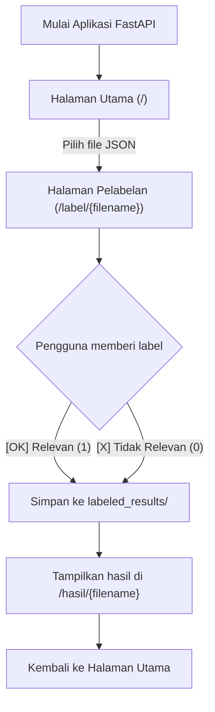

#  Alat Pelabelan (Labeling Tool) Berbasis FastAPI

Proyek ini merupakan **alat pelabelan berbasis web** yang dibangun menggunakan **FastAPI** dan **Jinja2**.
Tujuannya adalah untuk meninjau hasil *retrieval* dari file JSON, kemudian memberi label seperti **relevan** atau **tidak relevan** secara interaktif.
Hasil pelabelan disimpan otomatis dalam folder terpisah dan dapat digunakan untuk evaluasi model atau pembuatan dataset pelatihan AI/NLP.

---

##  Struktur Proyek

```
your_project/
├── retrieval_results/       # Folder berisi file hasil retrieval (.json)
│   ├── retrieval_apbd.json
│   └── retrieval_pajak.json
├── labeled_results/         # Folder untuk menyimpan hasil pelabelan
├── templates/               # Template HTML untuk FastAPI (Jinja2)
│   ├── index.html
│   ├── label.html
│   └── hasil.html
├── static/                  # (Opsional) Berisi file CSS/JS statis
└── labeling_tool.py         # Program utama FastAPI
```

---

##  Persyaratan

Instal semua dependensi berikut terlebih dahulu:

```bash
pip install fastapi uvicorn jinja2 starlette
```

Opsional (untuk dukungan form upload atau logging tambahan):

```bash
pip install python-multipart
```

---

##  Cara Menjalankan Aplikasi

Jalankan aplikasi FastAPI menggunakan **Uvicorn**:

```bash
uvicorn labeling_tool:app --reload --port 8000
```

Kemudian buka di browser:
👉 [http://127.0.0.1:8000](http://127.0.0.1:8000)

---

##  Alur Kerja Aplikasi

Berikut adalah diagram alur logika kerja aplikasi:



---

##  Penjelasan Tiap Template

### **index.html**

Menampilkan daftar file `.json` yang tersedia untuk diberi label.

### **label.html**

Antarmuka utama untuk memberi label pada teks (menggunakan form HTML).
Pengguna dapat membaca setiap *chunk* teks dan memilih label relevan atau tidak relevan.

### **hasil.html**

Menampilkan hasil pelabelan yang telah disimpan, lengkap dengan teks dan nilai labelnya.

---

##  Contoh Struktur File JSON

**Contoh input (`retrieval_apbd.json`):**

```json
[
  {
    "chunk_id": "chunk_001",
    "filename": "apbd.txt",
    "text": "Pemerintah daerah menetapkan anggaran berdasarkan kebutuhan publik..."
  },
  {
    "chunk_id": "chunk_002",
    "filename": "apbd.txt",
    "text": "Laporan realisasi anggaran menunjukkan peningkatan pada sektor pendidikan..."
  }
]
```

**Contoh output hasil pelabelan:**

```json
[
  {
    "chunk_id": "chunk_001",
    "filename": "apbd.txt",
    "text": "Pemerintah daerah menetapkan anggaran berdasarkan kebutuhan publik...",
    "label": 1
  },
  {
    "chunk_id": "chunk_002",
    "filename": "apbd.txt",
    "text": "Laporan realisasi anggaran menunjukkan peningkatan pada sektor pendidikan...",
    "label": 0
  }
]
```

---

##  Catatan Tambahan

* Nilai label dapat diubah atau ditambah (misalnya `2 = netral`, `3 = tidak yakin`) dengan menyesuaikan bagian **radio button** di `label.html`.
* Aplikasi ini sudah mendukung **CORS**, sehingga bisa diintegrasikan dengan sistem atau dashboard lain.
* Jalur folder (`CHUNK_FOLDER` dan `LABEL_OUTPUT_FOLDER`) dapat diatur di bagian awal file `labeling_tool.py`.
* Anda dapat menambahkan file CSS di folder `static/` untuk mempercantik tampilan antarmuka web.

---

##  Lisensi

Proyek ini dirilis di bawah lisensi **MIT License**.
Silakan digunakan, dimodifikasi, dan dikembangkan untuk kebutuhan penelitian, anotasi data, maupun proyek NLP lainnya.

---
